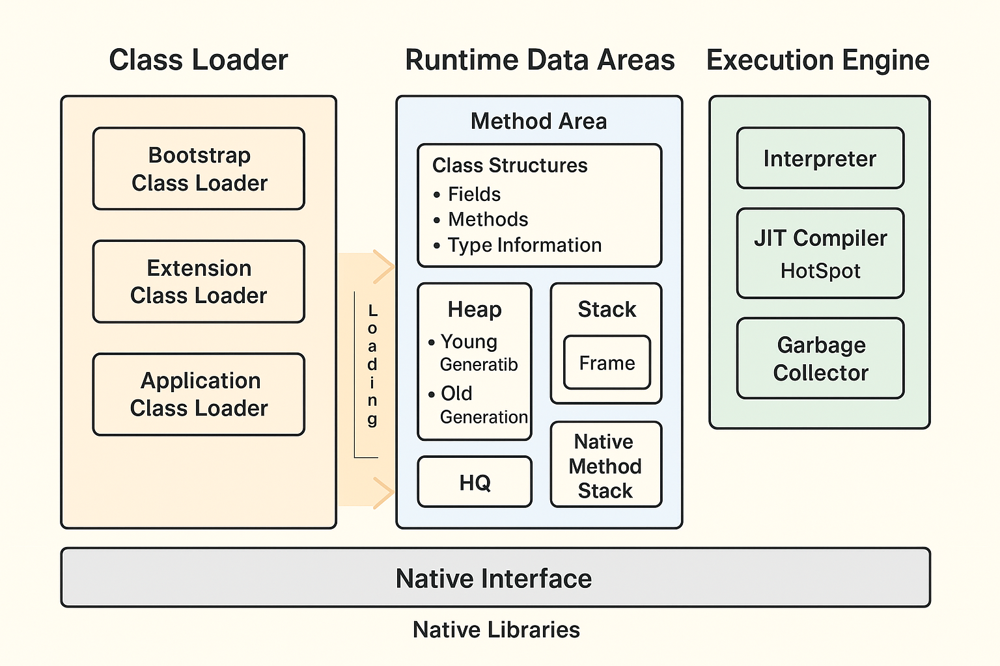

# JVM Architecture Report

This document explains the major components of the Java Virtual Machine (JVM), how bytecode is executed, the difference between the Just-In-Time (JIT) compiler and the interpreter, and why Java follows the "Write Once, Run Anywhere" (WORA) principle.

---

## 1. High-level diagram of JVM components

Below is a visual overview of the major JVM blocks:


### ASCII diagram (fallback)

```
+----------------------+          
|  .class files / JAR  |          
+----------+-----------+          
           |                      
           v                      
+--------------+                  
| Class Loader |  (loads, links, init)
+------+-------+                  
       |                          
       v                          
+----------------------------------------------+
|             Runtime Data Areas               |
|  Method Area | Heap | Stacks | PC | Native   |
+-----------------+----------------------------+
       |                          
       v                          
+----------------------+        
|  Execution Engine    |        
| Interpreter, JIT, GC |        
+----------------------+        
```

---

## 2. Class Loader Subsystem (How classes enter the JVM)

The Class Loader subsystem is responsible for locating and bringing class definitions (.class files) into the JVM and performing verification and linkage. The most common loaders are:

- Bootstrap Class Loader — loads core Java classes (java.lang, java.util, etc.)
- Extension / Platform Class Loader — loads extension and platform libraries
- Application / System Class Loader — loads application classes from the classpath

Typical loading lifecycle:
1. Loading — read .class bytes into memory
2. Verification — check bytecode validity and safety
3. Preparation — allocate storage for static fields
4. Resolution — replace symbolic references with direct references
5. Initialization — execute static initializers and assign static fields

These steps help ensure the JVM executes safe, well-formed code.

---

## 3. Runtime Data Areas (JVM memory model)

The JVM separates memory into areas shared across threads and areas private to each thread.

Shared memory areas:
- Method Area — stores class-level metadata (methods, fields, constant pool)
- Heap — main area for object and array allocation (managed by the garbage collector)

Per-thread memory areas:
- JVM Stack — contains stack frames for method invocations
- Program Counter (PC) Register — tracks the current instruction for each thread
- Native Method Stack — used for native (JNI) calls

Analogy: the Heap is a shared storage room, while each thread has a small bag (its stack) for temporary method-local data.

---

## 4. Execution Engine (how bytecode runs)

Main components:
- Interpreter — executes bytecode one instruction at a time (fast startup)
- JIT Compiler — compiles hot bytecode into native machine code for better performance
- Garbage Collector (GC) — reclaims unused objects on the heap
- Native Interface (JNI) — enables calls to native libraries (C/C++)

Typical runtime flow:
1. Class data is loaded and linked by the Class Loader
2. The interpreter executes bytecode initially
3. The JVM identifies "hot" methods and compiles them with the JIT
4. The GC runs periodically or on demand to reclaim memory

---

## 5. JIT compiler vs Interpreter (comparison)

| Feature | Interpreter | JIT compiler |
|---|---:|---:|
| Execution model | Executes bytecode instruction-by-instruction | Compiles bytecode to native machine code
| Startup time | Fast (no compile overhead) | Slower initially (compilation cost)
| Peak efficiency | Lower | Much higher for hot code
| Best for | Short-lived programs or cold code paths | Long-running applications and hot code paths

Modern JVMs use tiered compilation: they start with interpretation and progressively apply more aggressive compilation strategies as code becomes hot.

---

## 6. Step-by-step bytecode execution (summary)

1. Write Java source (.java) and compile to bytecode (.class).
2. Class Loader loads and verifies classes.
3. The JVM allocates class and object structures in Method Area and Heap.
4. The interpreter executes bytecode; hot methods are JIT-compiled.
5. GC reclaims unused objects; JNI handles native interactions when needed.

This pipeline balances safety, portability, and runtime performance.

---

## 7. Why Java is "Write Once, Run Anywhere" (WORA)

- Java compiles to platform-neutral bytecode rather than machine code.
- The JVM provides a platform-specific runtime that interprets or compiles bytecode to native code.
- Standard APIs and the JVM abstraction ensure consistent behavior across platforms.

Limitations to WORA:
- Native code via JNI introduces platform dependencies.
- Differences in JVM implementations or versions can create subtle behavior differences.
- OS-specific assumptions (file paths, encodings, locale data) can break portability.

---

## 8. Glossary

- Bytecode — platform-independent instructions produced by the Java compiler.
- Class Loader — component that loads .class bytecode into the JVM.
- Method Area — memory area holding class-level metadata and runtime constant pool.
- Heap — memory area for objects and arrays.
- JIT Compiler — runtime compiler that turns hot bytecode into optimized native code.
- Interpreter — executes bytecode sequentially when not compiled.
- JNI — Java Native Interface, used to call native (C/C++) code from Java.

---

## 9. References / further reading

- The Java Virtual Machine Specification (Oracle / OpenJDK)
- "Inside the Java Virtual Machine" (book / articles)
- OpenJDK HotSpot documentation (JIT and GC internals)