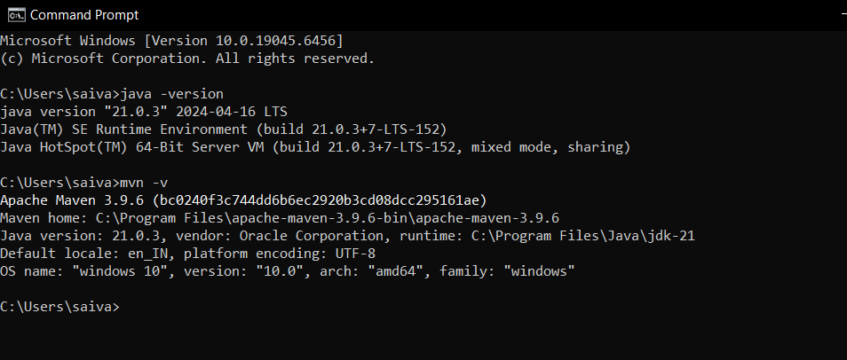

# Setup Instructions — Java & Maven (Windows / cmd.exe)

This file explains how to install Java 21 (JDK 21) and Apache Maven on Windows, set the required environment variables using the command prompt (cmd.exe), verify your installation, and run the Student Management System project.

Checklist
- Install JDK 21
- Install Apache Maven.
- Set JAVA_HOME and ensure Java is on PATH.
- Set MAVEN_HOME (or M2_HOME) and ensure Maven is on PATH.
- Verify installations with `java -version`, `javac -version`, and `mvn -v`.

1) Install Java (JDK 21)

Manual download
- Download a JDK 21 distribution (for example, Eclipse Temurin or Oracle JDK) from the vendor site and run the installer.
- Typical install path: `C:\Program Files\Java\jdk-21` (adjust to your actual path).

2) Set JAVA_HOME and update PATH (cmd.exe)
- Open a new Administrator command prompt if you want system-wide settings, or a normal prompt for user-level.
- Set JAVA_HOME (example path — change to your actual install folder):

```cmd
JAVA_HOME "C:\Program Files\Java\jdk-21"
```

- Add Java bin to PATH (this appends to the user PATH):

```cmd
PATH "%PATH%;%JAVA_HOME%\bin"
```

Important: after setting path in environment properties open a new command prompt so the updated environment variables take effect in that shell.

3) Verify Java installation

```cmd
java -version
javac -version
```
You should see Java 21 listed 

<!-- Add screenshot of `java -version` output -->


4) Install Apache Maven

Manual download
- Download the binary zip from https://maven.apache.org/download.cgi
- Extract to a directory, for example `C:\apache-maven-3.9.x`.

5) Set MAVEN_HOME (or M2_HOME) and add to PATH

```cmd
M2_HOME "C:\apache-maven-3.9.6"
MAVEN_HOME "%M2_HOME%"
PATH "%PATH%;%M2_HOME%\bin"
```

Open a new command prompt after this change.

6) Verify Maven

```cmd
mvn -v
```
